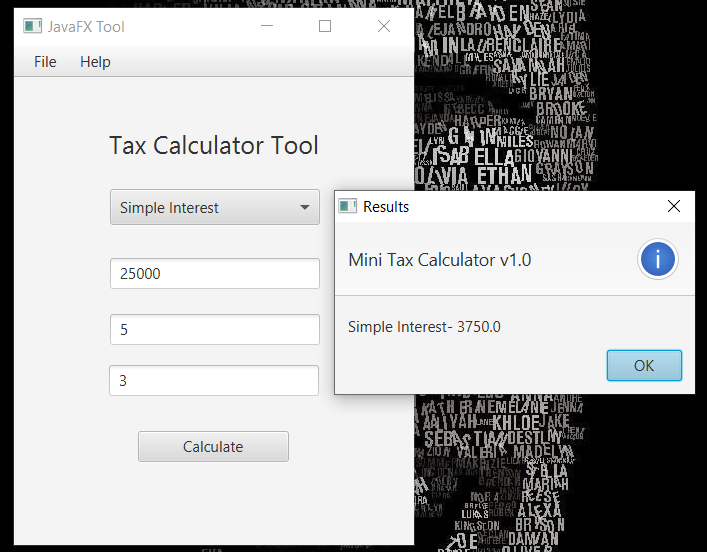

# Tax-Calculator-JavaFX
JavaFX Tool

JavaFX is a software platform for creating and delivering desktop applications, as well as rich Internet applications that can run across a wide variety of devices. JavaFX is intended to replace Swing as the standard GUI library for Java SE, but both will be included for the foreseeable future

Tax Calculator is a JavaFX GUI Tool which provides functionality to calculate Simple Interest & Compound Interest.
Simple interest is a quick and easy method of calculating the interest charge on a loan. Simple interest is determined by multiplying the daily interest rate by the principal by the number of days that elapse between payments.
Compound interest is the addition of interest to the principal sum of a loan or deposit, or in other words, interest on interest. It is the result of reinvesting interest, rather than paying it out, so that interest in the next period is then earned on the principal sum plus previously accumulated interest.

Preview : -

